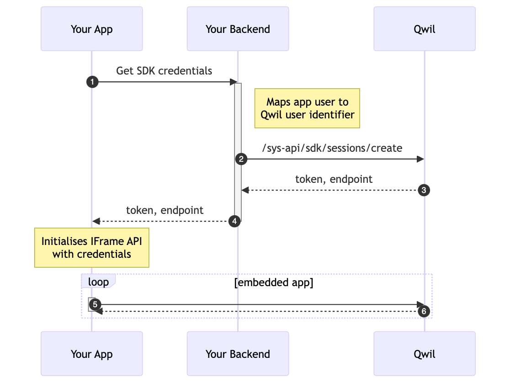

# Qwil IFrame API

This API allows you to embed a light version of Qwil within your own site or app. The API also includes methods that 
you can use to subscribe to application events, and programmatically trigger commands.

SDK access must be enabled for your organisation in order to use this API. Speak to Qwil Support for details.

## Usage Model

A typical usage model is as follows.



1. Client-side app requests SDK credentials from backend. It is crucial that the Sys Api Keys are never exposed to the client, so the next step must be done in the backend.
2. The backend maps the app user to an associated Qwil user, and makes a sys api call to retrieve a session token.
3. The API call returns a session token and an endpoint tha the token can be used against.
4. The token and endpoint is returned to the Client app. There is no need to store this token as it should be recreated for each new session.
   * Client-side app initialises the iFrame API, passing in the token, endpoint and any additional options.
5. Qwil is embedded as an iFrame in the app. It is authenticated as the user defined in step 2.


## Integration

### Loading the library

To use the iFrame API, you need to load the Javascript library in your app.

To get started quickly, you can load it directly from a public CDN that references this repository. For example:
```html
<script src='https://cdn.jsdelivr.net/gh/qwilio/qwil-iframe-api/dist/qwil-iframe-api.js'></script>
```

Or you, can download the latest [release](https://github.com/qwilio/qwil-iframe-api/releases) and host it yourself.

Support for ESM modules will come shortly.

### Creating an element for the iFrame

Add an HTML element with a unique id attribute to your document. 
We will be referencing the element in the next step, and it will be used for embedding the iFrame.

```html
<div id="qwil-container"></div>
```

### Creating the Qwil API Object

Once the library has loaded, we are ready to instantiate the `QwilAPI` object.

The API object is instantiated as such:

```javascript
const config = { 
   token: "(token returned by backend)", 
   endpoint: "(endpoint returned by backend)",
   targetElement: document.getElementById('qwil-container'),
}
const api = QwilApi(config);
```

The `config` object accepts the following fields:
   * `token`: _(REQUIRED)_ The session token. This value is to be retrieved from a System API call (see Usage Model above).
   * `endpoint`: _(REQUIRED)_  The endpoint associated with the session token. This value is to be retrieved from a System API call (see Usage Model above).
   * `targetElement`: _(REQUIRED)_  DOM element to add iFrame to.
   * `width`: Width of the iFrame. Defaults to `"100%"`.
   * `height`: Height of the iFrame. Defaults to `"100%"`.
   * `replaceTargetContent`: If `false`, generated iFrame is appended to `targetElement`'s children. Otherwise, the default behaviour is to replace the content of `targetElement`.
   * `options`: Additional customisations.
       * `options.path`: Custom path to navigate to once the app is initialised e.g. starting on a specific chat.
       * `options.theme`: _[NOT YET AVAILABLE]_ CSS overrides to customise the look and feel of the app
       * `options.contactsTappable`: if `true`, contacts are tappable and will raise a "click-on-contact" event when contacts are tapped within the app.
       * `options.imagePreview`: if `false`, the in-app image preview is disabled and clicking on images will trigger downloads instead.
       * `options.pdfPreview`: if `false`, the in-app PDF preview is disabled and clicking on pdf files will trigger downloads instead.
       * `option.emitDownloads`: if `true`, `download-request` event are emitted instead downloads. This allows you to handle the download/preview logic yourself.
   * `appDomain`: Target a different app variant. For example, setting to "beta-sdk.qwil.io" will embed a beta version of Qwil instead of the production version. 
   * `onLoad`: Callback function when app is loaded and user is authenticated
   * `onError`: Callback function when app fails to load or authentication failed

Here's a more complete example:

```javascript
const api = QwilApi({
   token: tokenFromBackend,
   endpoint: endpointFromBackend,
   targetElement: document.getElementById('qwil-container'),
   onLoad: (api) => {
     console.log('Qwil login successful');
     
     // api object is also passed to onLoad callback, which we can use to register callbacks. E.g.
     api.on('auth-expired', async () => {
       console.error('Session token has expired');
       return handleExpiry();
     })
   },
   onError: (error) => {
     console.error(`Qwil login failed with ${JSON.stringify(error)}`);
     // handle error here. E.g. display placeholder content
   },
});

async function handleExpiry() {
  // If session token expires, we can reauthenticated the app without having to reload everything.
  const { token, endpoint } = await getNewCredentialsFromBackend();
  return api.reauthenticate({ token, endpoint });
}

function navigateToChat(chatUuid) {
  // this can be called by your app to trigger navigation
  api.sendCommand('navigate', { path: '/chats/' + chatUuid });
}
```

In the example above, we have subscribed to an event (`api.on("auth-expired", callback)`), called an API functions (`api.reauthenticate()`), and trigger a command (`api.sendCommand('navigate', {path})`). 

Events, functions and commands are described in the sections below.

## Events

The QwilApi object implements the [EventEmitter](https://nodejs.org/api/events.html) API for emitting and listening for events.

You can add event listeners using the `on` or `addListener` method:

```javascript
api.on(event, listener);
```

If you want to remove a listener you can use the `off` or `removeListener` method:

```javascript
api.removeListener(event, listener);
```

The `event` parameter is a string object with the name of the event.

The `listener` parameter is a function object with one argument that will receive the event payload.

The following events are currently supported:

### auth-expired

Emitted when the session token has expired. This event has no payload.

### app-error

Emitted when there is an application error e.g. when something fails to load, or an action is not possible.

The listener receives an object with the following structure:

```javascript
{
  message: string // The error message
}
```

### click-on-contact

Emitted when `contactsTappable` feature is enabled and a user taps on a contact.

The listener receives an object with the following structure:

```javascript
{
  firstName: string // First name of the contact
  lastName: string // Last name of the contact
  entityUserXrefUuid: string // Qwil UUID for the contact
  identifier: string // Qwil user identifier for the contact
  isMe: boolean // True if the contact is the user themself
}
```

### download-request

Emitted when `emitDownloads` feature is enabled and a user taps on a button/file that would otherwise trigger downloads.

This allows you to handle the download logic yourself. Files are embedded in the payload as 
[Data URLs](https://developer.mozilla.org/en-US/docs/Web/HTTP/Basics_of_HTTP/Data_URLs).

Or, when used with `imagePreview=false` or `filePreview=false`, you could intercept the taps on image/pdf files and
handle the previews yourself.

The listener receives an object with the following structure:

```javascript
{
  filename: string // name of the file
  url: string // The data URL of the file.
}
```

## Functions

Functions perform an API-level operation.
### reauthenticate

Updates the session token used by the app.

```javascript
api.reauthenticate({ token, endpoint })
  .then(() => {
    // successful
  }).catch((err) => {
    // failed
  });
```

### destroy

Removes the embedded iFrame and releases resources. This should be called when the page is unloaded.

```javascript
api.destroy();
```

## Commands

Commands are used to request actions within the app, for example to trigger a navigation to a different page.

Commands are different from function in several ways:
1. It is non-blocking and does not have a return value
2. It does not change the state of the API. It merely requests for an operation to be handled by the embedded app which may or may not be fulfilled.
3. More commands will be support over time without the need for you to upgrade the IFrame API library.

### navigate

Triggers an in-app navigation, e.g. to a specific chat.

```javascript
api.sendCommand('navigate', { path })
```

# Example projects

Here are some sample projects that uses the Qwil IFrame API.

* Salesforce Lightning Web Component -- https://github.com/qwilio/qwil-salesforce-app
* Salesforce Lightning Web Component (Multi-org version) -- https://github.com/qwilio/qwil-salesforce-multiorg-app
* Client app
  * React example -- [TODO] 
  * React Native example -- [TODO]
* Backend
  * Flask example -- [TODO]
  * NodeJS example -- [TODO]
